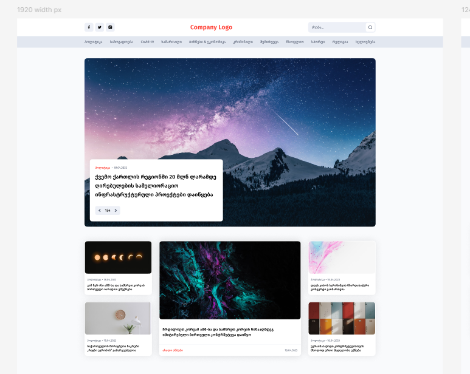
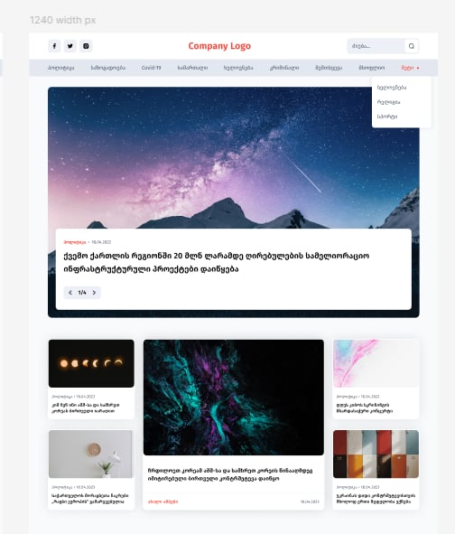
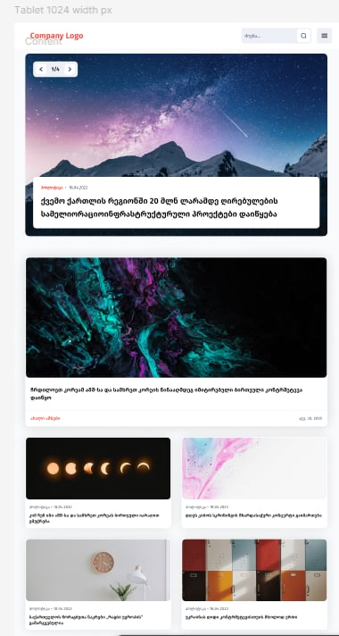
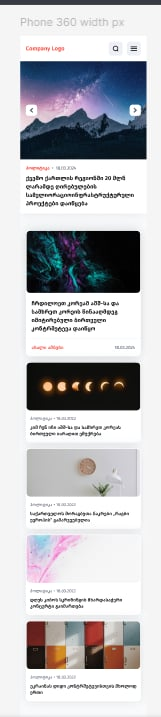

# Women-in-AI-group-project solution

## Table of contents

- [Overview](#overview)
  - [The challenge](#the-challenge)
  - [Links](#links)
- [My process](#my-process)
  - [Built with](#built-with)
  - [What we learned](#what-we-learned)
  - [Continued development](#continued-development)
  - [Useful resources](#useful-resources)
- [Author](#author)
- [Acknowledgments](#acknowledgments)

## Overview

### The challenge

Users should be able to:

- See and use a dropdown menu on 1240px for the header's navbar
- Navigate through sliders and see different information appropriate to the slider on all resolutions
- See a burger menu on mobile version and use it to show and hide navigation bar
- View the optimal layout for the interface depending on their device's screen size
- See hover states for all interactive elements on the page

### Links

- Live Site URL: [Add live site URL here](https://your-live-site-url.com)

## My process

### Built with

- Semantic HTML5 markup
- Flexbox
- CSS Grid
- Desktop-first workflow
- [SASS](https://sass-lang.com/) - CSS preprocessor
- SCSS (SASS syntax)
- [Styled Components](https://styled-components.com/) - For styles
- Vanilla JS

<!-- ------------------------------------------- -->

<!-- Please don't touch anything above the line ^ -->

### What we learned

<!-- write here what you learnt during work on the project -->

- **Anastasia**: Learned XYZ
- **Nano**: Learned XYZ

### Continued development

<!-- write what you plan to improve on in the future next to your name -->

- **Anastasia**: XYZ
- **Nano**: XYZ

<!-- Use this section to outline areas that you want to continue focusing on in future projects. These could be concepts you're still not completely comfortable with or techniques you found useful that you want to refine and perfect. -->

### Useful resources

- [Example resource 1](https://www.example.com) - This helped me for XYZ reason. I really liked this pattern and will use it going forward.
- [Example resource 2](https://www.example.com) - This is an amazing article which helped me finally understand XYZ. I'd recommend it to anyone still learning this concept.

## Author

- Github - [Add your name here](https://www.your-site.com)

- Github - [Add your name here](https://www.your-site.com)

- Github - [Add your name here](https://www.your-site.com)

## Acknowledgments

<!-- This is where you can give a hat tip to anyone who helped you out on this project. Perhaps you worked in a team or got some inspiration from someone else's solution. This is the perfect place to give them some credit. -->
